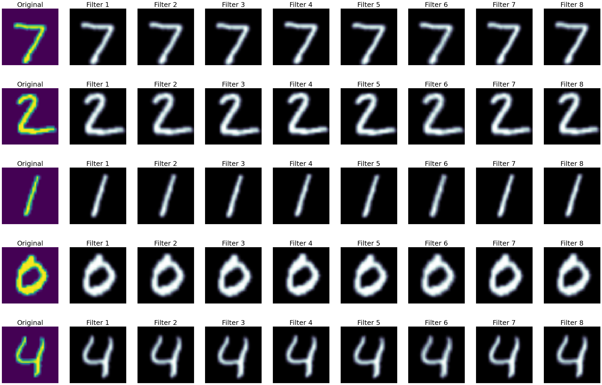
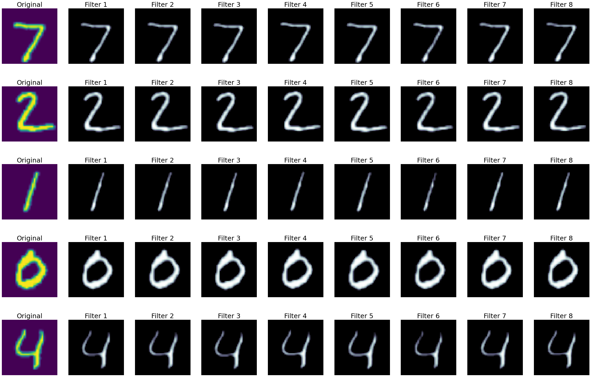
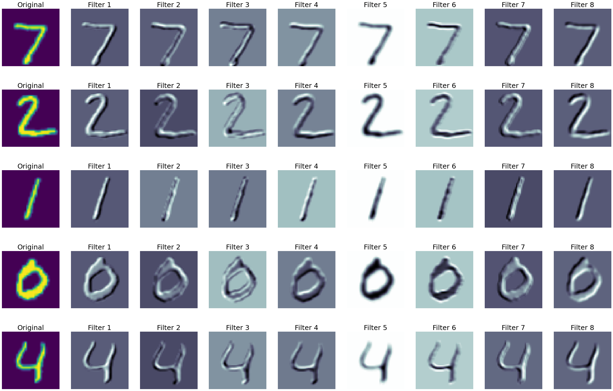
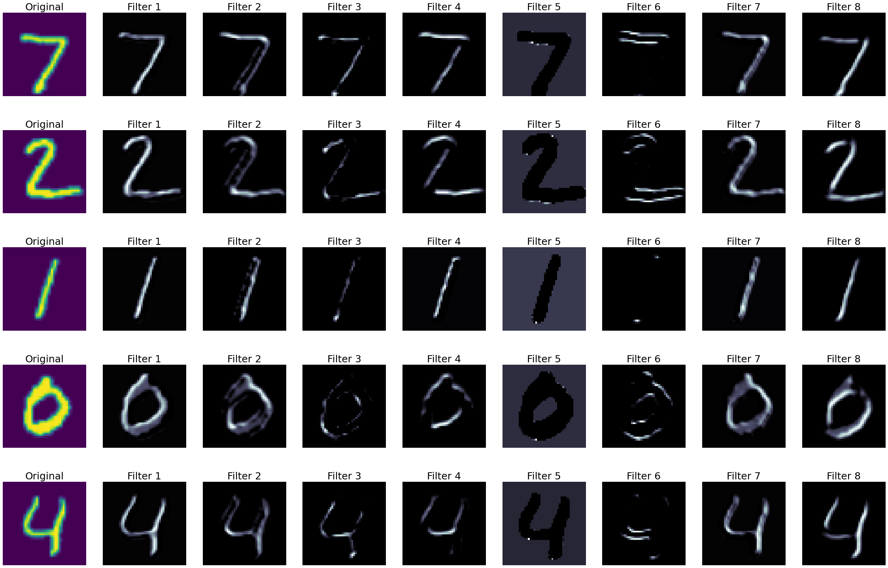
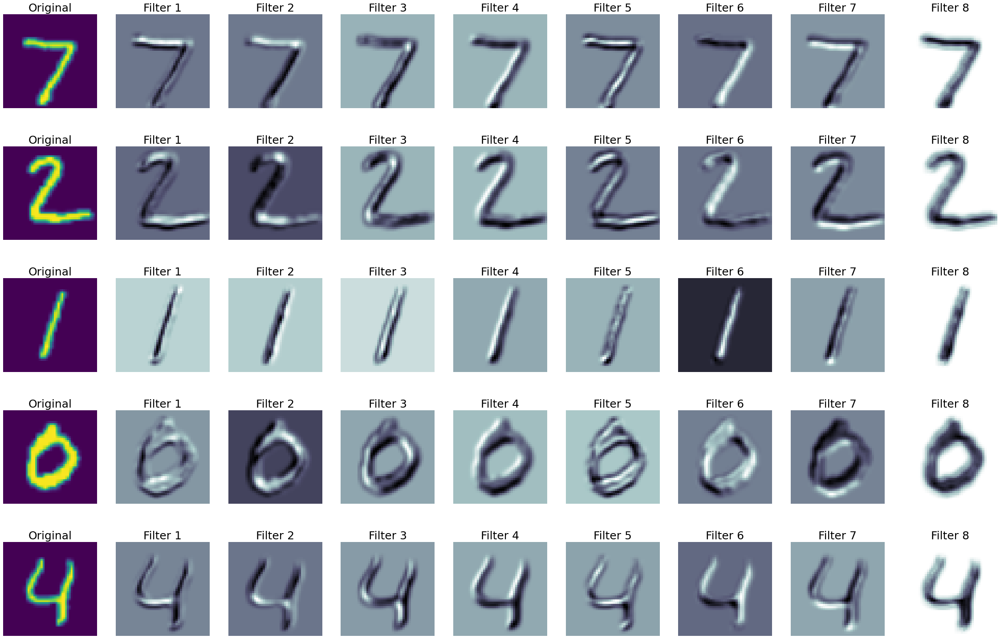
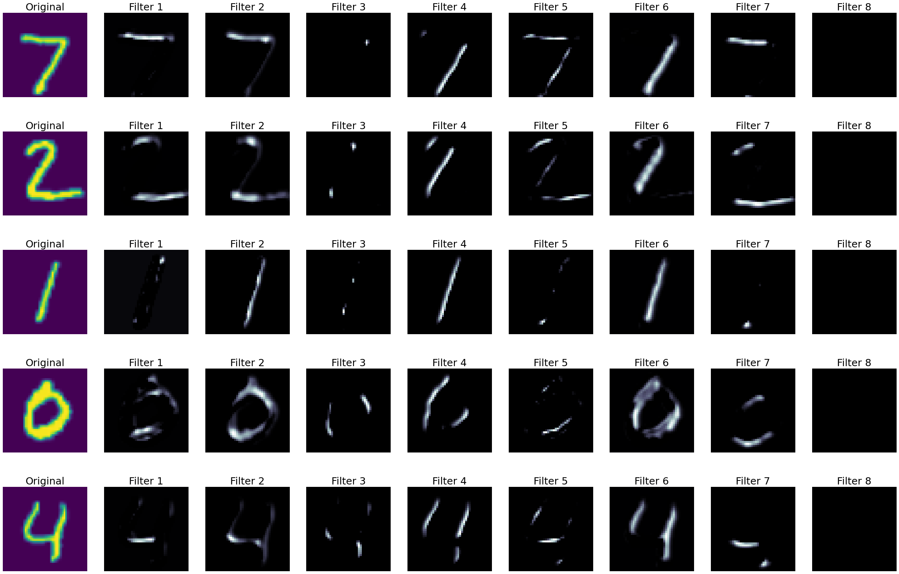
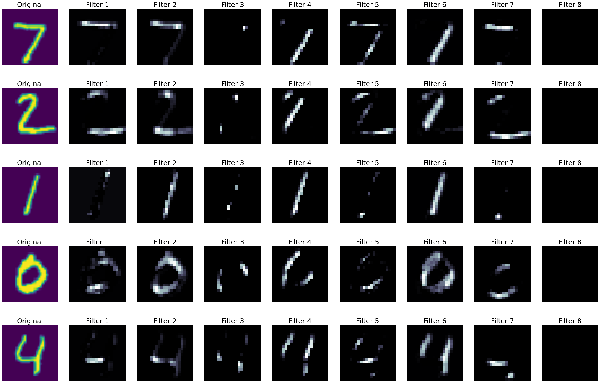
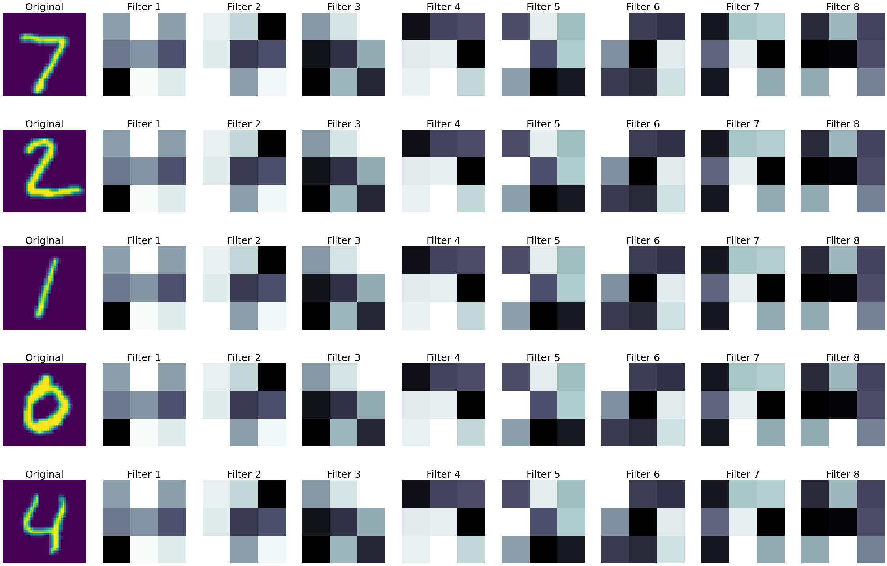
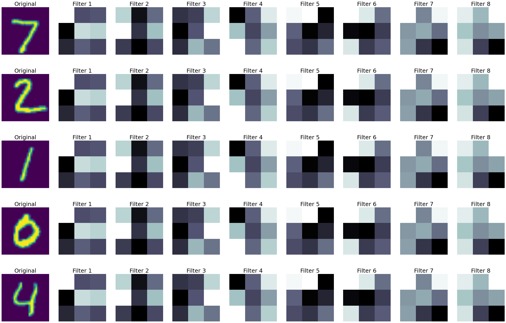
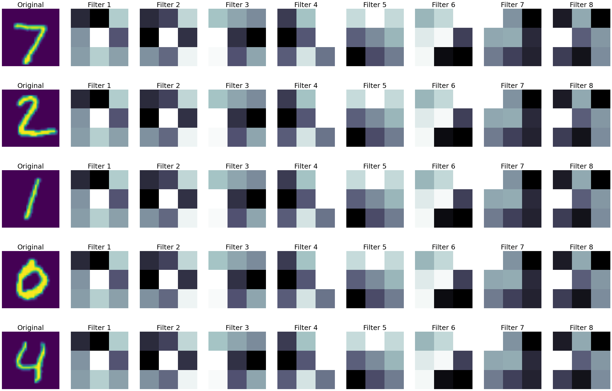

# CNN_Layers


In this project, I have written a code that we can use to see the feature maps of a CNN's layers or the output of each layer. I have used ```PyTorch``` because the accessibility to each layer is better and more convenient. 
First of all, clone the repository and run ```cnn's_layers_visualization```. 
In this project, I have used a simple CNN network consisting of 3 convolutional layers, 3 Relu layers and a Maxpooling layer. 

After importing ```Dataset``` and ```Dataloader``` we'll go through defining our model. The data set is ```MNIST```. After training the Model, we can go for analyzing each convolutional layer and see its outputs and feature maps. 

Before going through the above process, first we have to determine 4 parameters:

```
n_images = 5
n_filters = 8
layer_num = 1
plot_feature_map = False / True
```

We need to determine how many input images we want to check the results. here we will see feature maps and outputs of each layer for ```n_images = 5``` images. Since each layer can have a different number of filters, we have to determine how many of those filters we want to see, which are ```n_filters = 8``` here. If you like, you can increase the number of filters and plot all filters of a convolutional layer to see their outputs and feature maps. Through ```layer_num``` we can determine which layer we want to see.

We can either plot feature maps or outputs, using ```plot_feature_map``` which is a ```boolean``` variable.

here are the outputs of the first 7 layers of my model.

after passing from first convolutional layer (```conv1```) we have following results: 



By applying a ```relu``` activation function, we have following results:



after ```relu1``` layer we will give our images to ```conv2```:


like previous, after ```conv2``` there is a ```relu2``` layer:


outputs of ```conv3``` layer:


outputs of ```relu3``` layer:



outputs of ```Maxpooling``` layer:



Now let's see how our feature maps operate, it seems that some feature maps are extracting features that are showing the vertical pixels brightness changes, such as ```filter 2```  in the outputs of the layer ```conv3```  or ```filter 6``` in the outputs of ```conv2```, although it seems that the recent feature map is somehow a vertical edge detector too. Also, some other filters are calculating the derivative of the input. such as ```filter 7``` in the outputs of the layer ```conv2```. Furthermore, it seems that the ```filter 6``` in the layer ```conv3``` is extracting the feature of diagonal changes in pixels brightness. In general, each filter extracts a feature that makes the classification more accurate. features such as vertical and horizontal changes of brightness, edge detection, derivative, corner detection, and so on. 

Now let's see the feature maps of each convolutional layer, First, change the parameter ```plot_feature_map``` to ```True``` and specify the layer number, the layer number must be the number of a convolutional layer, because obviously ```Relu``` layer has no feature map:  

Feature maps of the first convolutional Layers:



Feature maps of the second convolutional Layers:


Feature maps of the third convolutional Layers:


